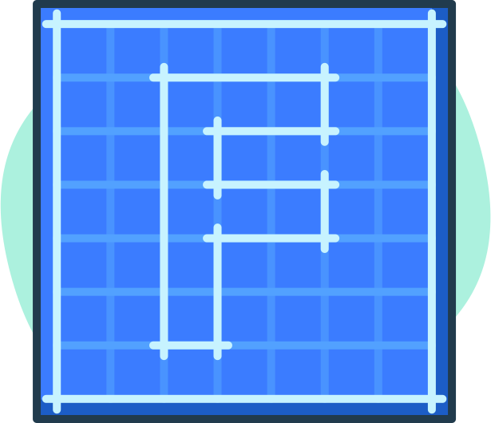

    
    <h1>
        <a href="https://frappe.io">
            frappé
        </a>
    </h1>
    <h3>
        a web framework with <a href="https://www.youtube.com/watch?v=LOjk3m0wTwg">"batteries included"
    </h3>
    <h5>
        it's pronounced - <em>fra-pay</em>
    </h5>

Full-stack web application framework that uses Python and MariaDB on the server side and a tightly integrated client side library. Built for [ERPNext](https://erpnext.com)

### Installation

[Install via Frappé Bench](https://github.com/frappe/bench)

## Contributing

1. [Pull Request Requirements](https://github.com/frappe/erpnext/wiki/Pull-Request-Guidelines)
1. [Translations](https://translate.erpnext.com)

### Website

For details and documentation, see the website

[https://frappe.io](https://frappe.io)

### License

MIT License
