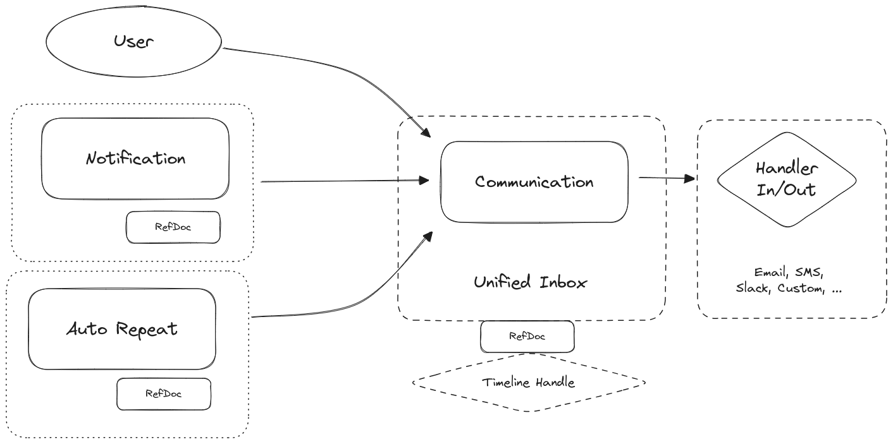

# Communications Module

The communications module in frappe integrates external communication, housing all built-in communication infrastructure except for Email, which has its own module due to its importance and complexity.
Adapters implement the bridge to the email module.

Desk Notifications and Comments are part of the Desk module, handling backend-specific communication.
However, when comments and alerts are notified by email, this is still done through the communications module.

## Architecture

The diagram illustrates the positioning of the Communication and Notification Doctype in a typical message flow.

When a reference document is set, Communication is also displayed in that document's timeline, where a user can initiate a Communication over a particular document.

Every medium has at least an Outgoing handler, and some also have an Incoming handler to receive incoming communication, either initiated or as a reply.

Specially crafted incoming communication can be used to create new documents or to comment directly on a particular timeline.
Where the medium permits, a correlation id may be used to correlate incoming communication to a particular outgoing communication and timeline.

Email is complex enough to have its own module alongside the communications module.

## Communication Medium Implementers

When implementing a new communication medium, implementers need to implement outgoing, and optionally, incoming handlers for the Communication doctype of their medium.

They should also implement a low-level gateway API so that their implementation can be used outside of the communication infrastructure.

Examples include system notifications such as 2FA SMS sending or a password reset email, which should _not_ end up in the unified communication log as they are not relevant communication for the core business.

## Roadmap: 360 Inbox

Currently, `inbox.py` implements mainly Email Inbox functionality. However the entities and relations
are already in place to implement a unified 360 inbox capable of unified transactional communication
accross the likes of email, chat, sms, webhooks, etc.
