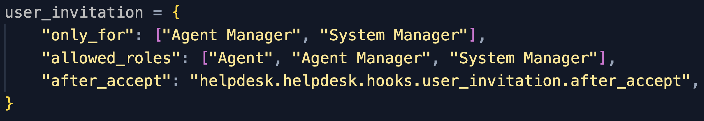

# User Invitation

The purpose of this doctype and its related public APIs is to store all of the common logic of a typical user invitation flow. This will help ensure consistency and prevent code duplication for custom framework applications that need this type of feature.

## How to use it?

These are the steps to use this doctype or its related APIs properly:

1. Define user invitation hooks in your app's `hooks.py` file.
   

   - `only_for`: Roles that are allowed to invite users to your app.
   - `allowed_roles`: Roles that are allowed to be invited to your app.
   - `after_accept`: Dot path of the function (`(invitation: Document, user: Document, user_inserted: boolean) => void`) to execute after the user accepts the invitation.

   > `after_accept` is optional and should be used only if there is some code to execute after accepting an invitation.

2. If you are not using Desk to manage invitations, you should use these exposed methods: `frappe.core.api.user_invitation.invite_by_email` and `frappe.core.api.user_invitation.accept_invitation` to create and accept invitations.

## Normal flow

1. Invitations are created from Desk or by using the `frappe.core.api.user_invitation.invite_by_email` exposed method. An email is sent to the invited email with a link to accept the invitation.
2. The app administrator can cancel the invitation from Desk.
3. Once the invitation is accepted, the user is created with the roles specified in the invitation and is redirected to the specified path.
4. If the invitee doesn't accept the invitation within three days, the invitation is marked as expired by a background job that executes every day. Currently, there is no way to customize the expiration time.

## Important points:

- The emails associated with existing users can't be invited.
- There can't be multiple pending invitations for the same app.
- Once an invitation document is created from Desk, all of the fields are immutable except the `Redirect To Path` field which is mutable only when the invitation status is `Pending`.
- To manually mark an invitation as expired, you can use the `expire` method on the invitation document.
- To manually cancel an invitation, you can use the `cancel_invite` method on the invitation document.
