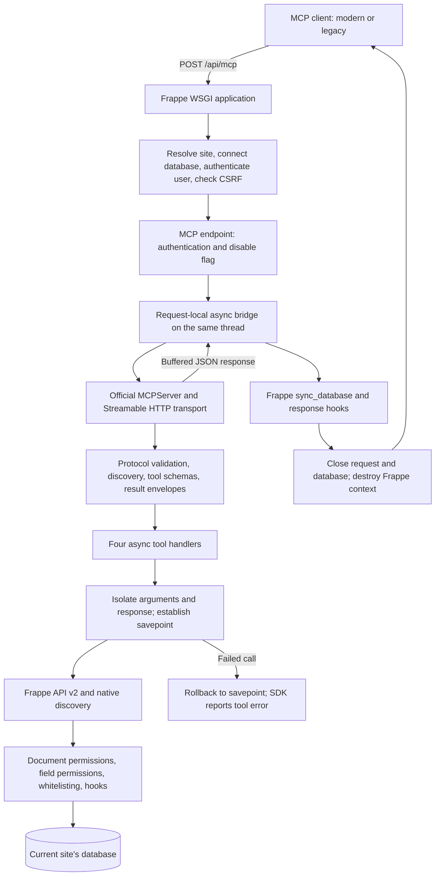

# Built-in MCP SDK demo

This prototype serves the official Python MCP SDK at `POST /api/mcp` on every site.
The branch is `demo/MCP`. The dependency is `mcp~=2.3.0`.
It proves that Frappe can host the SDK without moving its web application to ASGI.
It is a prototype for review, not a production release.

## Analysis of PR #41933

The [closed PR](https://github.com/frappe/frappe/pull/41933) has the same endpoint and a similar four-tool surface.
Its business operations reuse API v2, discovery, and Frappe permissions.
The custom work concerns the MCP protocol: JSON-RPC envelopes, dispatch, version negotiation, headers, and error responses.
Therefore, describing every part as built from scratch would overstate the difference.

The PR targets synchronous WSGI directly. It supports `2026-07-28` and the `2025-11-25` handshake revision.
It uses JSON responses, existing authentication, and a savepoint around each tool call.
Its description explicitly identifies the newer protocol as a good fit for plain WSGI request/response workloads.
It does not state why it rejected the SDK.

This demo replaces that protocol implementation with the official SDK's server and HTTP transport.
It keeps the Frappe request lifecycle and API v2 operations.
It names the write tool `write_documents`, as requested. The PR names that tool `write_document`.
Despite the plural name, the demo changes one document per call.

## Architecture



### Request lifecycle

1. Frappe selects the site and initializes its database connection and request context.
2. Frappe authenticates the request through its existing session, API token, or OAuth code.
3. `/api/mcp` rejects guests. `disable_mcp_server` disables the endpoint with `404`.
4. The bridge starts an AnyIO event loop on the current WSGI thread.
5. A fresh SDK server and stateless session manager handle one HTTP request.
6. The SDK validates MCP messages and tool arguments, then calls the registered handler.
7. The handler uses Frappe's current user and database connection.
8. The SDK produces the response. The bridge buffers it as a Werkzeug response.
9. Frappe commits successful writes through its normal request lifecycle and closes the connection.

Frappe stores request state in a ContextVar. AnyIO tasks inherit that context.
The handlers are deliberately `async def`, although their database operations remain synchronous.
The SDK runs synchronous tool functions in worker threads. That would move Frappe's database work across threads.
These async handlers keep the synchronous work on the original request thread.
They must not offload database work or start parallel tasks that share this connection.

The bridge adapts ASGI HTTP messages. It does not decode JSON-RPC or dispatch protocol methods.
Frappe skips its usual JSON body parser for this endpoint so malformed MCP input reaches the SDK.
The outer form dictionary stays empty, which also prevents an envelope's `cmd` from selecting Frappe's legacy RPC path.

## Tools

| Tool | Operations | Permission behavior |
| --- | --- | --- |
| `discover` | Site summary, name search, DocType fields, method contract | Filters DocTypes and fields by read permission. Method discovery requires System Manager. |
| `get_documents` | Read one document, list documents, count matches | Uses API v2 read, list, and count handlers. List pages contain 1–100 rows. |
| `write_documents` | Create, update, delete one document | Uses API v2 handlers and controller hooks. Rejects document flags and changes to the target identity. |
| `call_method` | Dotted RPC, DocType module method, document method | Uses API v2 whitelisting, method overrides, server scripts, HTTP verb checks, and document permissions. |

The SDK builds input schemas from Python signatures and Pydantic constraints.
Successful tools return text content and `structuredContent`.
Expected Frappe failures become SDK tool errors with `isError: true`.
Unexpected exceptions receive the SDK's generic error message and server-side logging.

For `call_method`, GET-only methods use GET. Frappe also registers QUERY for those methods.
Other methods default to POST. The optional `http_method` selects another allowed verb.
The selected verb applies only inside the handler and is restored before Frappe finishes the HTTP request.
Document methods retain API v2's read/write permission mapping.
The outer MCP request remains POST, including its authentication, CSRF checks, and transaction completion.

## Try the demo

Use a running bench and a user with the needed document permissions.
Install the declared dependency after checking out this branch:

```sh
env/bin/python -m pip install 'mcp~=2.3.0'
```

Set the site's canonical public URL so the SDK can check Host and Origin independently of incoming headers:

```sh
bench --site your.site set-config host_name http://your.site:8000
```

Use your actual web-server port. Existing `allow_cors` origins are accepted, but `*` does not disable the SDK Origin check.
The SDK also accepts the canonical site's origin. Clients outside a browser normally omit Origin.

Set `FRAPPE_MCP_AUTHORIZATION` to a complete authentication header in your shell.
Use `token <api-key>:<api-secret>` or `Bearer <access-token>`.
The client reads the credential from the environment and does not print it.

Run these commands from the bench root:

```sh
env/bin/python -m frappe.mcp.demo_client http://your.site:8000
env/bin/python -m frappe.mcp.demo_client http://your.site:8000 --mode legacy
env/bin/python -m frappe.mcp.demo_client http://your.site:8000 --write-demo
```

The default demo lists tools, discovers ToDo fields, reads a page, and calls `frappe.auth.get_logged_user`.
`--write-demo` creates a ToDo, reads it, updates it, and deletes it in a finally block.
Deletion still requires permission and can fail. Inspect the printed document name if cleanup fails.

The endpoint works without a new DocType or database migration.
Restart the existing web process if it does not reload changed Python code.
The SDK client's default mode uses modern discovery. `--mode legacy` exercises the handshake flow.

For clients that perform OAuth discovery, enable protected resource metadata in the existing OAuth Settings.
This demo reuses Frappe's OAuth code. It does not add an SDK authorization server or dedicated MCP scopes.
API-token authentication and both SDK client modes were tested. Interactive OAuth authorization was not tested.

## Verification

The isolated site is `mcp-test.localhost`, using SQLite. Existing development sites were not used for test writes.
Run the focused suite with:

```sh
bench --site mcp-test.localhost run-tests --module frappe.tests.test_mcp --lightmode
```

The 11 tests cover both protocol revisions, four tool schemas, document CRUD, lists, counts, discovery, and permission denial.
It checks normal-user identity, GET-only methods, wrong verbs, non-whitelisted methods, and rollback after a partial write.
It also calls a document method and checks normal REST API requests.
It also checks malformed JSON, notifications, mismatched headers, guests, the disable flag, and untrusted origins.
One test starts an ephemeral local HTTP server and connects the official SDK client in both modes.
The HTTP server shuts down after the test.

`--lightmode` skips Frappe's global fixture setup. The tests still use Frappe WSGI and a real database.
All 11 focused tests passed. The changed-file pre-commit checks and commit-message checks passed.
The standard runner's global fixture setup encountered an unrelated SQLite database lock on this bench.
The broader API test selector also encountered a missing `hypothesis` development dependency during discovery.
MariaDB, PostgreSQL, Gunicorn, interactive OAuth, and third-party MCP clients still need validation.

## Limits and production work

- Each request creates an event loop, SDK server, schemas, and session manager. Measure latency and memory before deciding to cache.
- Synchronous database work blocks this request's async loop. WSGI workers remain occupied until the tool finishes.
- Responses are buffered. GET and DELETE return `405`. There is no SSE, resumability, or persistent session.
- Sampling, client roots, progress streams, subscriptions, and server-initiated requests are outside this demo.
- Stateless legacy mode does not preserve negotiated client capabilities between HTTP requests.
- Savepoints undo database changes only. File writes, external calls, queued jobs, and transaction callbacks can survive a failed tool.
- A method that commits explicitly can invalidate the savepoint. Such methods need transaction-policy work before a stronger rollback guarantee.
- Generic RPC methods retain their own permission checks. Whitelisting alone does not make a method safe or read-only.
- Binary downloads and multipart uploads do not fit the JSON-only method adapter.
- API v2 functions are internal. A production implementation should extract shared operations instead of depending on their location indefinitely.
- Root discovery checks permissions across DocTypes. It truncates results and has no cursor. Large sites need measured caching and pagination.
- The endpoint is enabled by default on this demo branch. Review deployment defaults and tool exposure before rollout.
- SDK upgrades need compatibility tests. The version range stays within the tested 2.3 release line.

## Possible extensions

1. Add app hooks for registered tools, resources, and prompts while retaining the small default tool list.
2. Expose permission-filtered resources for documents, schemas, and reports.
3. Add site policy for allowed methods, writable tools, and dedicated OAuth scopes.
4. Add audit records, request correlation, tool timing, and output-size limits.
5. Add idempotency controls and background-job handles for long operations.
6. Add bulk document tools with explicit transaction and failure semantics.
7. Move the MCP transport to a persistent ASGI service if streaming or callbacks become requirements.
8. Add elicitation for workflow inputs after defining how retried calls avoid duplicate side effects.
9. Add a client matrix and load tests across sites and worker processes.

An ASGI service would need its own Frappe context and database lifecycle for every tool call.
It cannot retain a live database connection from a completed WSGI request.

## References

- [Official Python SDK](https://py.sdk.modelcontextprotocol.io/)
- [SDK integration with an existing application](https://py.sdk.modelcontextprotocol.io/run/asgi/)
- [SDK legacy client support](https://py.sdk.modelcontextprotocol.io/run/legacy-clients/)
- [MCP 2026-07-28 introduction](https://modelcontextprotocol.io/docs/2026-07-28/getting-started/intro)
- [Closed Frappe PR #41933](https://github.com/frappe/frappe/pull/41933)
